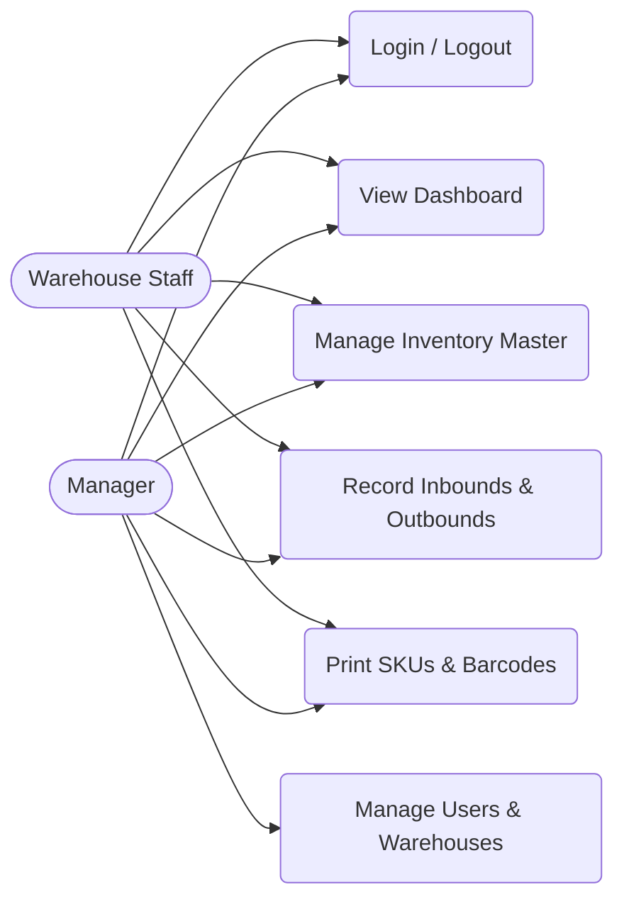
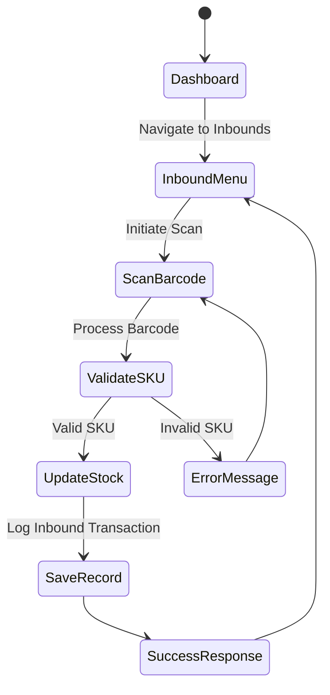
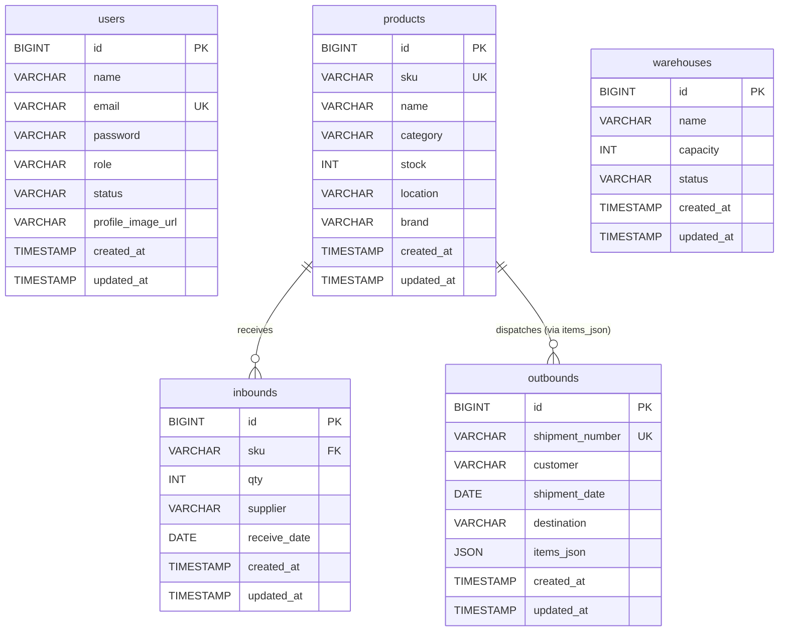
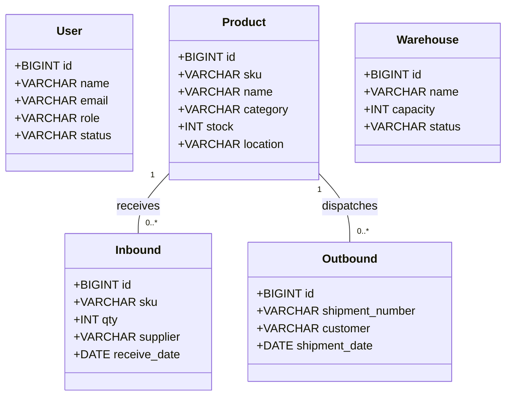

# Warehouse Management System (Berdikari Jaya)

A modern, responsive, and robust Warehouse Management System built with Laravel, JavaScript, and Chart.js. This system handles inventory master data, inbound and outbound tracking, user role management, and provides a real-time analytics dashboard.


## Core Features

- **Real-time Dashboard**: Interactive Bar and Doughnut charts showing daily item flows and category distributions.
- **Master Inventory Management**: Full CRUD operations for managing product catalogs.
- **Inbound/Outbound Tracking**: Log incoming shipments, track suppliers, and manage outbound dispatch records.
- **User Role Management**: Manage staff, supervisors, and managers with custom profile avatars via external image links.
- **Fully Responsive Layout**: Built with a custom CSS Grid that scales seamlessly across desktops, tablets, and smartphones.
- **Barcode Generation & Printing**: Instantly generate CODE128 barcodes for SKUs and print them directly from the system.

## Technology Stack

- **Backend Framework**: Laravel 11 (PHP)
- **Database**: MySQL
- **Frontend Layer**: Blade Templates, Vanilla JS, Custom CSS3 Grid
- **Libraries**:
  - [Chart.js](https://www.chartjs.org/) for Data Visualization
  - [JsBarcode](https://lindell.me/JsBarcode/) for Barcode generation
  - [FontAwesome](https://fontawesome.com/) for Icons
  - [UI-Avatars](https://ui-avatars.com/) for fallback profile images

---

## System Visualizations & Diagrams

### 1. Use Case Diagram
This diagram outlines the interactions between different roles (Warehouse Staff and Manager) and the system's features.



### 2. Activity Diagram (Inbound Workflow)
Below is the typical workflow of an inbound scanning and logging transaction.



### 3. Entity Relationship Diagram (ERD)
The database structure separates user management, master data, and transactional logs optimally for read speed.



### 4. Logical Record Structure (LRS)
The logical representation of our database tables and their keys:
- **Users** (**id [PK]**, name, email, email_verified_at, password, role, status, profile_image_url, remember_token, created_at, updated_at)
- **Products** (**id [PK]**, sku, name, category, stock, location, brand, created_at, updated_at)
- **Inbounds** (**id [PK]**, *sku [FK]*, qty, supplier, receive_date, created_at, updated_at)
- **Outbounds** (**id [PK]**, shipment_number, customer, shipment_date, destination, items_json, created_at, updated_at)
- **Warehouses** (**id [PK]**, name, capacity, status, created_at, updated_at)

### 5. Class Diagram
Represents the core Eloquent models in the architectural pattern handling the application's domain logic.



---

## Installation Guide

Follow these instructions to set up the project locally.

1. **Clone the repository**
   ```bash
   git clone https://github.com/makhc1/Manajemen-Logistik.git
   cd Manajemen-Logistik
   ```

2. **Install PHP Dependencies**
   ```bash
   composer install
   ```

3. **Environment Setup**
   Copy the example environment file and configure your local Database credentials.
   ```bash
   cp .env.example .env
   ```
   *Note: Open `.env` and set `DB_DATABASE`, `DB_USERNAME`, and `DB_PASSWORD`.*

4. **Generate App Key**
   ```bash
   php artisan key:generate
   ```

5. **Run Migrations**
   Create all the required tables based on the ERD above.
   ```bash
   php artisan migrate
   ```

6. **Serve the Application**
   ```bash
   php artisan serve
   ```
   *Visit `http://localhost:8000` to interact with the application.*

---

## Recent Updates
- Transitioned Dashboard Charts (Weekly Flow & Category Distribution) to pull real-time data dynamically from the database.
- Implemented mobile-first responsive media queries, ensuring sidebars and grids collapse naturally on tablet and mobile viewports.
- Enhanced User Management with the ability to define external profile image URLs instead of consuming local storage.

## Contributing
For internal Berdikari Jaya development staff: Please create a feature branch off the `main` branch before submitting pull requests. Ensure all endpoints are tested and database changes come with proper migration files.
